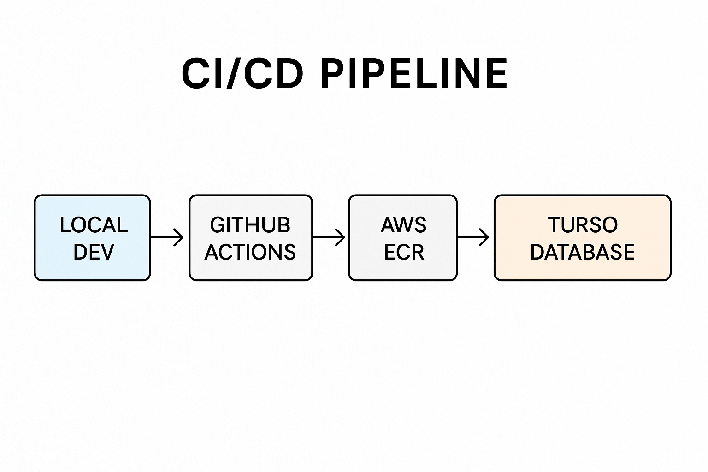
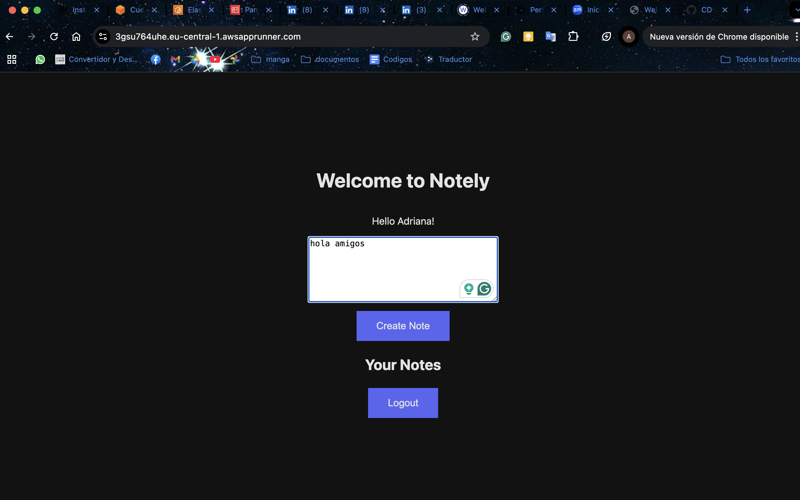

# 🚀 Notely - CI/CD with AWS App Runner, GitHub Actions, and Turso DB


# learn-cicd-starter (Notely)

This repo contains the starter code for the "Notely" application for the "Learn CICD" course on [Boot.dev](https://boot.dev).

## Local Development

Make sure you're on Go version 1.22+.

Create a `.env` file in the root of the project with the following contents:

```bash
PORT="8080"
```

Run the server:

```bash
go build -o notely && ./notely
```

*This starts the server in non-database mode.* It will serve a simple webpage at `http://localhost:8080`.

You do *not* need to set up a database or any interactivity on the webpage yet. Instructions for that will come later in the course!
Adriana's version of Boot.dev's Notely app.

This project implements a **Notely** application with continuous deployment using **GitHub Actions**, **AWS App Runner**, and a **Turso** serverless database managed with **Goose** migrations. It’s part of a practical learning path for modern CI/CD and DevOps.

---

## 📑 Table of Contents
1. 🛠️ Project Description  
2. 🖼️ Architecture Diagram  
3. ⚙️ Setup & Workflow  
4. 💻 Database Usage  
5. ☁️ Deployment with AWS App Runner  
6. 🧪 Testing  
7. 🏆 Results  
8. 🔮 Next Steps  

---

## 🛠️ Project Description
This project covers:  
- Automated builds and tests with **GitHub Actions**  
- Using **Turso DB** for data persistence  
- Managing schema changes with **Goose** migrations  
- Continuous Deployment (**CD**) on **AWS App Runner**  
- Secure handling of database credentials with GitHub Secrets  

---

## 🖼️ Architecture Diagram



---

## ⚙️ Setup & Workflow


# 1. Clone repository
```bash
git clone <REPO_URL>
cd learn-cicd-starter
```
 # 2. Install Goose (DB migrations)
```bash
go install github.com/pressly/goose/v3/cmd/goose@latest
goose -version   # should be >= v3.18.0
```
# 3. Configure Turso database
```bash
turso db create notely-db
turso db tokens create notely-db
```
# Save in .env (ignored in .gitignore)
```bash
PORT=8080
DATABASE_URL=libsql://notely-db-<yourname>.turso.io?authToken=<TOKEN>
```
# 4. Run migrations
```bash

chmod +x ./scripts/migrateup.sh
./scripts/migrateup.sh
```
# 5. Add GitHub Secret
```bash
# Go to: Settings -> Secrets -> Actions
# Name: DATABASE_URL
# Value: libsql://notely-db-<yourname>.turso.io?authToken=<TOKEN>
```
# 6. Update cd.yml (GitHub Actions workflow)
```bash
jobs:
  deploy:
    env:
      DATABASE_URL: ${{ secrets.DATABASE_URL }}
```
## 💻 Database Usage
# Connect to DB shell
```bash
turso db shell notely-db
```
# Verify tables
```bash
PRAGMA table_info(users);
PRAGMA table_info(notes);
```
## ☁️ Deployment with AWS App Runner

* Build & Push Docker Image

* GitHub Actions builds Docker image.

* Publishes it to AWS ECR.

* Automatic Migration Before Deploy

* Runs ./scripts/migrateup.sh before deployment.

* AWS App Runner

* Environment variable DATABASE_URL provided via GitHub Secrets.

* Deployment is triggered on git push origin main.

## 🧪 Testing
# Set base URL
```bash
BASE=https://<your-app-id>.eu-central-1.awsapprunner.com
```
# Health check
```bash
curl -i "$BASE/v1/healthz"
```

# Create a user
```bash
curl -i -X POST "$BASE/v1/users" \
  -H "Content-Type: application/json" \
  -d '{"name":"Adriana"}'
```
# Create a note (replace <API_KEY>)
```bash
curl -i -X POST "$BASE/v1/notes" \
  -H "Content-Type: application/json" \
  -H "Authorization: ApiKey <API_KEY>" \
  -d '{"note":"My first Notely note!"}'
```
# View notes
```bash
curl -i -X GET "$BASE/v1/notes" \
  -H "Authorization: ApiKey <API_KEY>"
```
## 🏆 Results

* ✅ Automated CI/CD pipeline with GitHub Actions
* ✅ Secure migrations with Goose + Turso DB
* ✅ Continuous Deployment on AWS App Runner
* ✅ Working API with users & notes persistence

## 🔮 Next Steps

Add stronger authentication

Connect metrics and logs with AWS CloudWatch

Add load balancer for scaling

Integrate end-to-end tests in pipeline

Document endpoints with Swagger/OpenAPI

## 📌 Notes

# ⚠️ Important: The original assignment instructions required deploying with Google Cloud Run, but this implementation was adapted to AWS App Runner.

Due to permission limitations in the AWS Academy account, some GitHub Action deployments appear as “failing”, but the application itself runs correctly on AWS App Runner.



# * Author: Adriana Martínez


